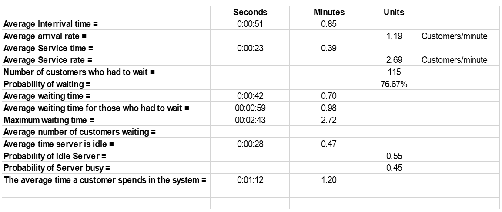

## SIMULATION OF A MULTIPLE SERVER QUEUING SYSTEM USING EXCEL AND ARE  SIMULATION PACKAGE

### Interim Report

#### Introduction:

Simulation modelling plays a big role in each and everyone&#39;s life, most of us are technologically connected in one way or other, we fly in aeroplanes, we pay visits to coffee or local shops, supermarkets etc.

Experts in the places mentioned above are likely to have made use of simulation modelling at some stage, the aviation industry stands out for its use of simulation to simulate different scenarios, conditions in a system and study them to see how they would compare in the real world. _Simulation,_ therefore, is defined as duplicating or imitating characteristics of a real-life system, this could be done with mathematical models, computers or even by hand.

 Simulation modelling involves carrying out statistical experiments and interpreting the output with statistical tests.

There are two types of simulation models;

Continuous model: This type of simulation deals with system whose behavior changes with time. Discrete model: deals with systems whose behavior changes that take place at specific discrete points in time. The later type will be the focus of the investigation with the aid of queuing theory.

I started my investigation with collecting data for the single server which I need to analyze and use the results from my distribution fitting investigation to generate random numbers for the two-server simulation. The reason for this is to get data that is as close to my chosen place of investigation rather than generating random data. By knowing how the data for single server is distributed I can generate random numbers following the results from the single-server calculations

**Data Collection**

**The Junction**

 Profile

The Junction is one of the cafeterias in the university, its located on the first floor of the Tower building block, its ran by a total of roughly eight staff members. The cafeteria opens 8:30 a.m.-5:00 p.m. weekdays, from what I gathered the cafeteria has two peak hours of interest on a given day, the first being 9:30 a.m.-10:15 a.m. which is worked by Arianna (the staff member I interacted with) after 11:00 a.m. she is joined by three other colleagues who operate during the busier peak hour which is the lunch hours.

I had nine choices when I first started to look for a place suitable for collecting my data, the plan was, I go to a place and try it out to see how it operates and then assess whether it would fit my model based on my criteria:

Location: Accessibility of the place in case I need to go back and collect more data.

 How it operates: I was particularly interested in places that operate with single server.

 Service times: Targeting the rush hour to get reliable results.

The above criteria narrowed down my choices to three places which included: Foyles Book shop Charing Cross road, Costa Café on the ground flow Tower building London Metropolitan University and The Junction also located in the Tower building but on the first floor.

However, when I got to try them out, both Foyles book shop and Costa café failed to meet the criteria, Foyles book shop failed because it had a very slow interarrival rate for a single server and Costa café failed because during busy times they introduced new server

The junction was the perfect place for me to collect data because they have the single server during a rush hour, ease of access to the cafeteria, good communication with management and staff, who gave me permission to collect data in their cafeteria.

How I collected the data.

I devised a plan to collect the data so that its&#39;s as reliable as possible.

Procedure;

I asked a friend of mine to help me out on the day.

The cafeteria has a wide entrance so we located ourselves in the center of the cafeteria which gave us a clear eyesight that allowed us to follow the customer from arrival to departure.

Upon arrival, a customer was assigned a number and their time of arrival was recorded by my colleague, the number assigned allowed me to track their journey in the system, this allowed me to record their start service time and end of service times.

In general, most customers followed the first in first out (FIFO) queuing discipline, this allowed me to collect reliable data as it made it easy to track a single customer from the time they come in to the end. I also decided to ignore the bulking and reneging customers, this was done to make my data collection easier and these customers would not have had any effect on the service times which is one of the main key data.

**Data analysis**

**How I calculated the key data?**

Most of the data analysis is done in Excel spread sheets

Referencing data sheet Key data

**General**

| **Column** | ** Excel Data** |
| --- | --- |
| **A** | Customers |
| **D** | Arrival |
| **E** | Start Service |
| **F** | End Service |

| **Column** | **Key Data** | **Column** | **Key Data in Mins (R\*1440)** |
| --- | --- | --- | --- |
| **B** | Interarrivals | **C** | Interarrivals |
| **G** | Waiting time | **H** | Waiting time |
| **I** | Service time | **J** | Service time |
| **K** | Time in system | **L** | Time in the System |
| **M** | Idle time | **N** | Idle Time |

All data was converted to minutes using the formula

Time t(in Secs) X 1140

For example 0.00.23×1440=0.38mins

Excel general formula A1 where A stands for the column and 1 stands for the row number, in this text its referenced A1 with row numbers as
subscripts.

**Interarrival**

Interarrival = Arrival Tt-1 -Tt Where T is Time to the nearest seconds and t ≥ 0

Excel Formula = DR-1-DR  Where R stands for Row

**Waiting time (Queueing time)**

I calculated the waiting time for those who had to wait. That&#39;s to say if a customer came but someone was already in the system.

Excel Formula = If (Fn -D n+1 > 0, Fn - D n+1 
) where n > 0 for any row

**Service Time.**

Service time was calculated by getting the difference between End service and Start Service.

Formula = End service – Start Service

Excel Formula = Fn- En where n > 0 for any row

**Time in the System**

Total time in the system is the difference between arrival and departure time

Formula = End Service – Arrivals time

Excel Formula = Fn- Dn

**Idle time of the server**

The idle time of the server was calculated for all the time the server was not serving any one during the period we collected data.

 Excel Formula = IF(En+1-Fn> En+1-Fn,0)

**Averages**

 

Average(ColumnRow:ColumnRow)

E.g. Interarrivals average Average(B4:B153)0.00.51

First calculated to the nearest second then converted it to minutes

E.g. interarrivals in secs 0.00.51 ∗ 1440 = 0.85mins (2dp).

**Calculation for average Rates**

Average arrival rate = NumberofCustomers/Totalinterrival(mins) = 150/125.98= 1.19 customers/min

Average Service rate = NumberofCustomers/TotalServiceTime(mins) = 150/55.70= 2.69 customers/min

**Probability of waiting**

Formula =Noofcustomerswhowait/TotalnumbercustomersX100= 115/150X100= 76.67%

**Probability of Idle Server**

Formula =  TotalIdletime/TotaltimeofdatacollectionX100= 0.55%

**Probability of Server busy**

Formula = 1 – Probability of Idle Server = 1 – 0.55 = 0.45%

**Maximum wait time**

Excel Formula = Max(H) = 2.72 minutes

**Histograms for interarrival and Service times.**

 

Figure 1 Interarrival time histogram

 

Figure 2 Service time histogram

For the interarrival the positive skew is down to the peak hour, this is the time most customers (students and staff) are about to start classes so they pick up their coffee and snacks for breakfast. This in-turn creates a positive skew for the service time because the more customers that arrive the quicker the server and sometimes because they are going to class they just need to pick up quick things hence service time is shorter.

The histograms for both the Interarrival and Service time show that the data is positively skewed, with this kind of strong skew, normal distributions cannot be relied on to get the distributions, with aid of sophisticated software we can turn to alternative statistical distributions to know how our empirical data is distributed.

**Probability distribution functions**

Distribution fitting is one of the procedures for selecting a statistical distribution that best fits the empirical data, it&#39;s the best scientific way to deal with random process and anything that involves uncertainties in general, probability distributions help us perform reliable calculations and minimise the risk building models on biased data. As the saying goes garbage in garbage out (G.I.G.O).

For my data, I used EasyFit software to find out the goodness of fit for my data, the software calculates the goodness of fit for over sixty-one distributions and ranks them in order the goodness of fit test ranking.

I used the top five ranking for my Interarrival time and service time, the software I used gave more weight to A.D test compared to Chi square and K.S test, i.e it ranked a distribution as first even though it had a low critical value (p value) compared to K.S test. The software also had graphs for each distribution to aid the decision maker.

**Probability density function**

**Interarrival**

 

Figure 3 Log-logistic distribution histogram

 

Figure 4 All top five distribution histogram.

For interarrival time the EasyFit software ranked Log-logistic as the best distribution that fits my data, this was done using the A.D test which I describe in more detail in the goodness of fit, however I have included the histogram with all five distributions to give a clear picture of how the first ranked distribution faired in comparison to the top five distribution, I also did the same for Service time later in the Appendix I shall include more graphs to show how my data was calculated for different distributions.

**Interarrival time**

Top ranked distributions

Log-logistic distribution

The two-parameter log-logistic where the continuous shape was α 0.99431 and the continuous scale was β 0.25434

**Service times**

 

Figure 5 Pearson 6(4P) distribution histogram

 

Figure 6 All top five distributions histogram

Service time the Pearson 6 (4P) from the Pearson family of distribution was ranked number one by both the K.S test and the Chi square test. It has four parameters as the name suggests two  shape parameters α1
 1.1278 and α2 7.604, β 2.1086, γ 0.02934.
Both of my top ranked distributions fell in the non-negative distribution type which is defined to x≥∞ for the continuous location parameter, when gamma is fixed at 0 the distribution is simplified hence the different distributions with in the same family.

**How it is chosen**

**Goodness of Fit**

Goodness of fit measures how well a theoretical probability distribution function to see performs on the random sample,

Goodness of fit is normally tested using a number of different tests depending on the data, the distribution fitting software(EasyFit) I used to analyse my data used the three main tests to analyse data which where: Chi Square, Kolmorgorov-Simirnov test and the Anderson Darling test.

Chi square test

The Chi Square test groups data before it tests it, hence its perfect for discrete data however if used on continuous data it&#39;s not as reliable because the bins that it formed from the data might not reflect the actual intervals from the original data. The test is most useful to test discrete data and sometimes testing discrete data against continuous data.

For both of my data sets the Chi square test had good results for the distributions it ranked high and hence suitable for to use however the same distributions were ranked lower than the K.S and A.D even when it had higher critical values, this is because is the way the Chi square is calculated and the fact that my data is continuous.

Kolmorgorov-Simirnov test (K.S test)

This test is based on the empirical cumulative distribution function, its only suitable for continuous data, unlike the Chi Square the K.S test doesn&#39;t rely on the cumulative function distribution being tested, hence the sample size doesn&#39;t matter. However, the K.S test is more sensitive towards the centre than the tails, which makes the validity of the data being tested vulnerable if it&#39;s skewed. Also for the K.S the distribution must be fully specified otherwise the test value will not be valid.

All the distribution I am using came from this test; they had good ranking on the K.S test.

Anderson Darling test (A.D test)

The A.D test is a modification of the K.S test mentioned above, it gives more weight to the tails than the K.S test, it makes use of the specific distribution in calculating critical values, this allows for more sensitive test however if these critical values are not available the A.D test cannot be used for testing or it will give invalid results.

This test rejected my Interarrival time data sets for all points, however the Service time data sets scored well with the Pearson 6 (4P) with A.D test accepting all five critical values for each distribution.

**Using other graphical techniques**

There are two commonly used graphs when it comes to testing how well the data fits the distribution; the Quantile-Quantile plot: this tests the two data sets of random data to test whether they come from the same distribution. If the plotted data align with the forty-five-degree line perfectly then the data plotted is a good fit. The P-P is also assessed in a similar manner to the Q-Q plot i.e we use the graph to see how well the plotted points follow the trend, however the data points for P-P plot are plotted in the opposed direction.

**Evaluation**

The investigation is still on schedule; however I have missed a few deadlines that I had set myself because I became ill during the Christmas period. I have also changed the choice of software package from JaamSim to Arena because Arena is a more sophisticated software and it will be able to handle my project better compared to what JaamSim would have done.

On the data collection, I had a sample size to collect which limited me and perhaps causes the strong positive skew, increasing my sample size would have had a different distribution perhaps a normal one, however I got to the 150 customers as soon as the peak hours was about to start to calm down.

I am happy with software I used to get the distribution as it is the same software used by large companies in the industry so I got to familiarize myself with it.

**Appendix.**

I have attached the required data from excel and the rest of the graphs for extra evidence as to why I chose the distribution I selected.

**Bibliography:**

**Books**

Banks, J., Carson, J. S., Nelson, B. L., &amp; Nicol, D. (2004). _Discrete-event system simulation_ (4th ed.). Upper Saddle River, NJ, United States: Pearson Education (US). In-line Citation: (Banks, Carson, Nelson, &amp; Nicol, 2004)

Render, B., Stair, R. M., &amp; Hanna, M. E. (2011). _Quantitative analysis for management_ (11th ed.). Harlow, Eng.: Pearson Education. In-line Citation: (Render, Stair, &amp; Hanna, 2011)

Taha, H. A. (2010). _Operations research: An introduction_ (9th ed.). Boston, MA, United States: Prentice Hall. In-line Citation: (Taha, 2010)

Collier, D. A., &amp; Evans, J. R. (2009). _Om2_
 _[With access Code] - 2nd edition_. Boston, MA, United States: Cincinnati, Ohio, U.S.A.: South-Western Pub. In-line Citation: (Collier &amp; Evans, 2009)

Law, A. M., &amp; Kelton, D. W. (2000). _Simulation Modelling and analysis_ (3rd ed.). Boston: McGraw Hill Higher Education. In-line Citation: (Law &amp; Kelton, 2000)

Winston, W. L., Goldbert, J. B., &amp; Winston (2003). _Operations research: Applications and algorithms_ (4th ed.). United States: Duxbury Press. In-line Citation: (Winston, Goldbert, &amp; Winston, 2003)

**Websites**

US Dept. of Commerce. 1.3.6.1. What is a probability distribution? Retrieved January 18, 2017, from Engineering Statistics Handbook, [http://www.itl.nist.gov/div898/handbook/eda/section3/eda361.htm](http://www.itl.nist.gov/div898/handbook/eda/section3/eda361.htm) In-line Citation: (n.d.)

State, T. P. (2017). Lesson 7: Confidence intervals. Retrieved January 18, 2017, from PennState Eberly College of Science, https://onlinecourses.science.psu.edu/stat200/node/46 In-line Citation: (State, 2017)

Technologies, M. (2004). Distribution fitting - using goodness of fit tests. Retrieved January 18, 2017, from Math Wave (EasyFit), http://www.mathwave.com/articles/distribution-fitting-goodness-of-fit.html In-line Citation: (Technologies, 2004)

